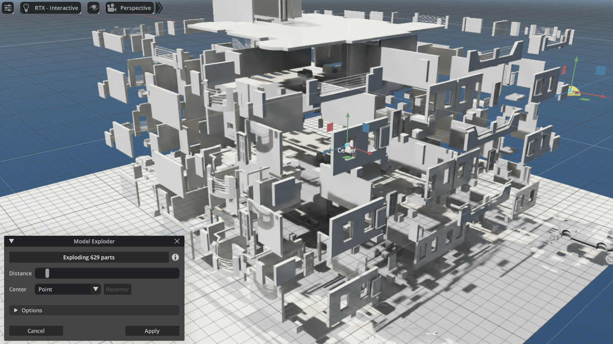
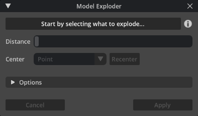
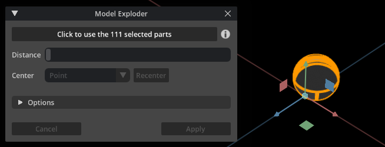
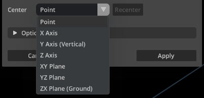
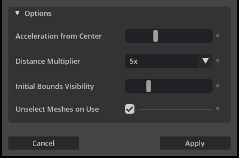
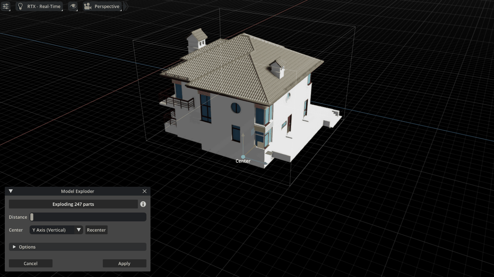
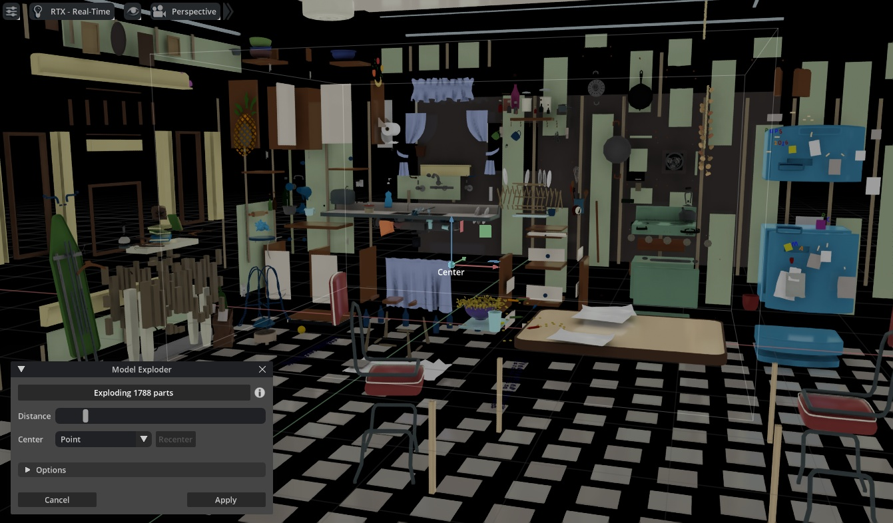

# Model Exploder Tool

Model Exploder separates a 3D model into its component parts for a better view of their relationship and how they fit together.

Model separation happens as if by a small controlled explosion, emanating from its center. This is often known as an [exploded-view](https://en.wikipedia.org/wiki/Exploded-view_drawing) of the model.

Exploded-views can be used to understand a model from its components and can also be used to create drawings for parts catalogs or assembly/maintenance/instruction information. Or in general, just to blow-up a 3D model.

## Quick links

* [Features](#features)
* [Installation](#installation)
* [How to Use](#how-to-use)
* [Credits](#credits)
* [Examples](#examples)

## Features
- Easy to use: select a model, click the Use button and move the Distance slider.
- Includes several ways to explode the model around a central point, axis or plane.
- Interactive editing of the explosion center: just drag the "Center" manipulator in the viewport.
- Works with meshes, USD Shapes, references/payloads. Point instances and skeletons are moved as a whole.
- Adds Undo-Redo state when applying changes.
- Works with NVIDIA's Omniverse Create, Code 2022+ or any other Kit-based apps. Compatible with multiple viewports and with the legacy viewport of older Omniverse versions.

## Installation

This tool is a plain Omniverse extension that can be installed like any other.

1. Download the latest [release](https://github.com/syntway/model_exploder/releases) or clone the [repository](https://github.com/syntway/model_exploder) into your computer.
2. In the Omniverse App (Create, Code, etc.), open the Extensions window from: Window menu > Extensions.
3. In the Extensions window, open the Settings page, by clicking the small gear button at the top of the left bar.
4. In the Settings page that appears at the right, you'll see a list of Extension Search Paths. Add the path location of the exts/ subfolder. This subfolder is inside the location to where you installed in step 1.
5. In the search field at the top left bar, next to the gear button, type model exploder - the tool should appear listed - click it.
6. Information about the Model Exploder tool will appear at the right side: check the Enabled and the Autoload checkboxes. The tool is now installed in your Omniverse app.

## How to Use

Select Model Exploder from the Tools menu...

... And the Model Exploder tool window appears:

Select models to explode: at least two parts must be selected (meshes, USD Shapes, etc).
The top button changes to "Click to use...". Click it to explode the selected parts.

Move the Distance slider and the parts are exploded from their shared center:

The Center combo box chooses the type of explosion movement: from a central point, around an axis or expanding from a plane.

Move the center point/axis/plane by dragging the Center manipulator in the viewport. Click the Recenter button to bring it back to the default middle position:

The Options section allows customization of the tool's behavior:

The available options are:
- Acceleration from Center: exploded parts accelerate based on their initial distance from Center.
This setting controls how farthest parts accelerate more than nearest ones.
- Distance Multiplier: multiply the explosion distance selected in the above slider.
For smaller or larger explosion scales.
- Initial Bounds Visibility: the visibility of the initial bounding box for the used shapes, from transparent to fully visible.
- Unselect Parts on Use: when starting to use a group of selected parts, should they be unselected for simpler visuals?

Finally, click the Apply button to add an Undo-Redo state. Or Cancel to return to the initial parts positions.

### Tips
- Click the ( i ) button for help and more information (opens this page).
- On complex models, the first interaction with the Distance slider might take a few seconds - next ones are much faster.
- If model parts do not separate and remain joined to each other:
  - Make sure model is divided in parts (meshes, USD shapes, etc), as this tools works by moving those parts.
  - With the Distance slider away from its leftmost position, move the Center manipulator in the viewport into the middle of the parts group.
  - Separate the group of "stuck" parts before separating the rest of the model.
- The initial bounds preview and center manipulator work in the active (last used) viewport. To change viewports, close the Model Exploder window and open again after using the new viewport.

## Credits
This tool is developed by [Syntway](https://www.syntway.com), the VR/Metaverse tools division of FaronStudio.

The tool uses SVG icons from [SVG Repo](https://www.svgrepo.com/).
3D models used in examples are from: [Bastien Genbrugge](https://sketchfab.com/3d-models/spherebot-17baf2bd295f460a924e62854ced1427), [mdesigns100](https://3dexport.com/free-3dmodel-residential-building-model-296192.htm), [dap](https://3dexport.com/free-3dmodel-ym-house-185521.htm), [KatSy](https://3dsky.org/3dmodels/show/chastnyi_dom_3) and Pixar's [Kitchen Set](https://graphics.pixar.com/usd/release/dl_downloads.html).

## Examples

